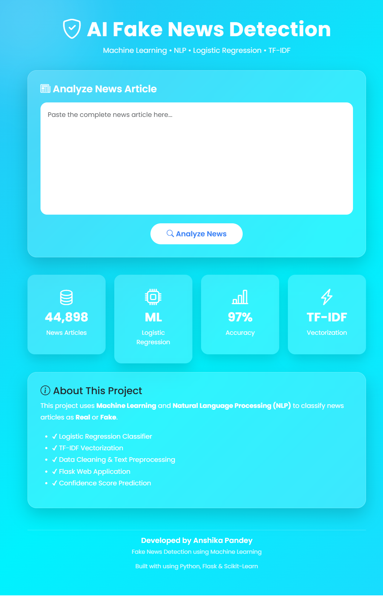
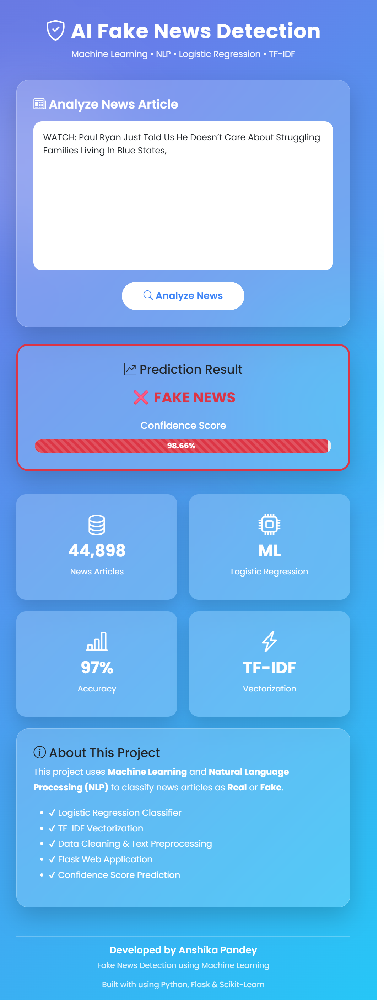
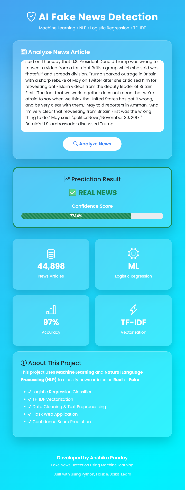
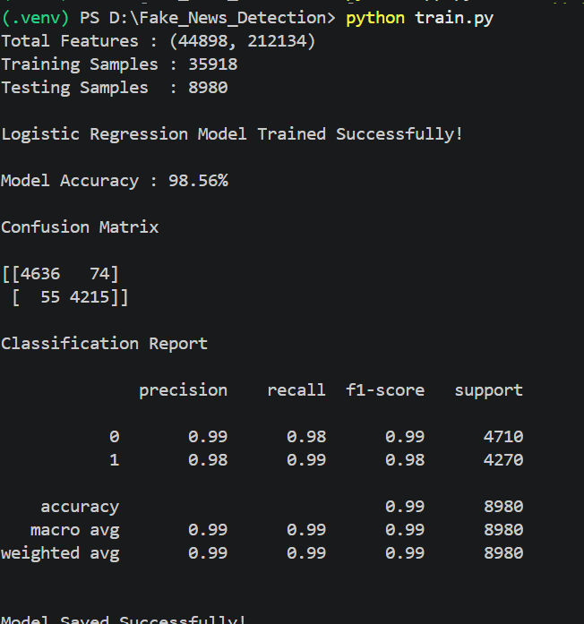

# 📰 AI Fake News Detection using Machine Learning

## 📌 Project Overview

This project is a Fake News Detection System built using Machine Learning and Natural Language Processing (NLP). It classifies a news article as **Real** or **Fake** based on its textual content.

The web application is developed using **Flask**, while the machine learning model is trained using **Logistic Regression** and **TF-IDF Vectorization**.

---
## 🌐 Live Demo
https://fake-news-detection-ml-4z5s.onrender.com

## 🚀 Features

- Detects Fake and Real News
- Confidence Score Prediction
- Machine Learning Based Classification
- Modern Flask Web Application
- Responsive User Interface

---

## 🛠 Technologies Used

- Python
- Flask
- Scikit-learn
- Pandas
- NumPy
- HTML5
- CSS3
- Bootstrap 5

---

## 🧠 Machine Learning Workflow

1. Load Dataset
2. Data Cleaning
3. Text Preprocessing
4. TF-IDF Vectorization
5. Train-Test Split
6. Logistic Regression Model
7. Model Evaluation
8. Save Model
9. Flask Deployment

---

## 📂 Dataset

The project uses two datasets:

- Fake.csv
- True.csv

Total News Articles: **44,898**

---

## 📊 Model Performance

- Algorithm: Logistic Regression
- Vectorization: TF-IDF
- Accuracy: 98.56%

Evaluation Metrics:

- Accuracy
- Precision
- Recall
- F1 Score
- Confusion Matrix

---

## 📸 Screenshots

### 🏠 Home Page



---

### ❌ Fake News Prediction



---

### ✅ Real News Prediction


### 📊 Model Accuracy


---

## ▶️ Installation

Clone the repository

```bash
git clone <repository-url>
```

Install dependencies

```bash
pip install -r requirements.txt
```

Run the training script

```bash
python train.py
```

Run Flask

```bash
python app.py
```

Open

```
http://127.0.0.1:5000
```

---

## 📁 Project Structure

```
Fake_News_Detection/
│
├── app.py
├── train.py
├── requirements.txt
├── README.md
├── .gitignore
│
├── dataset/
│   ├── Fake.csv
│   └── True.csv
│
├── model/
│   ├── model.pkl
│   └── vectorizer.pkl
│
├── static/
│   └── style.css
│
├── templates/
│   └── index.html
```

---

## 🔮 Future Scope

- BERT-based classification
- Deep Learning Models
- Live News API Integration
- Cloud Deployment

---

## 👩‍💻 Author

**Anshika Pandey**

IBM SkillsBuild Machine Learning Project